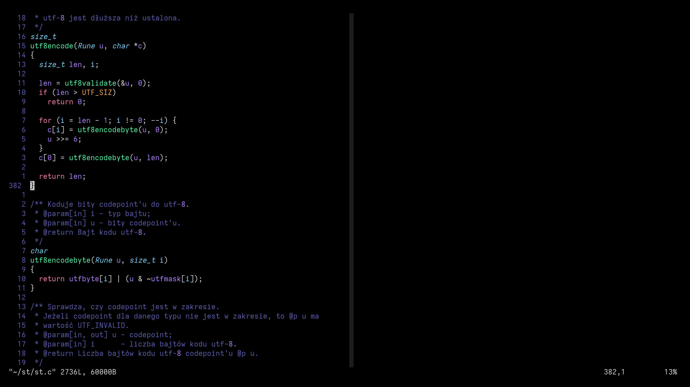

st - simple terminal
--------------------
st is a simple terminal emulator for X which sucks less.

vim
---
This repo is shipped with whole vim configuration and its colorscheme.
The colorscheme is basically Dracula, but with colors made more bland.

Requirements
------------
In order to build st you need the Xlib header files.
It's intended to be an add-on for my dwm repo, because of various
compatibilities. You can always have st standalone and take the scripts
from dwm repo instead.

Changes and my experience
-------------------------
First basic install, patching up, commands on terminal using shortcuts,
marking directories. To do: full st documentation in Polish.
First basic install, .vimrc, syntax highlighting, nice colorscheme,
To do: autocompletion, make .vimrc pretty, full vim config documentation
in Polish.

Configuration
-------------
Do it as you would with dwm. Once you clone the repo, on first time:
```bash
git submodule update --init --recursive
```

Preview
-------

